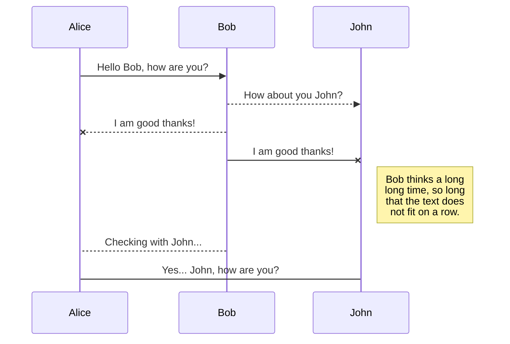
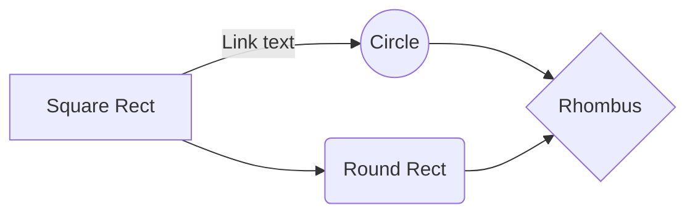

# Lab: Reconocimiento de imágenes mediante un comando de voz. Utilice las *APIs* de *Cisco Meraki*, *Imagga* y *Google Actions* para analizar la captura de una cámara de Meraki, mediante un comando de voz en un dispositivo *Android* con *Google Assistant*

## Introducción
En este laboratorio obtenemos un *snapshot* de una cámara *Cisco Meraki*, haciendo uso del *Dashboard API*. Luego, envíamos la imagen a un software de reconocimiento de imágenes llamado *Imagga*, cuyo *API* es de uso abierto. Finalmente, utilizamos la *API* de *Google Actions* para que nos lea las características de la imagen en voz alta, y nos muestre la imagen; mediante un comando de voz de *Google Assistant*.


## Objetivos

Al completar este laboratorio, estará familiarizado con el uso básico de las *APIs* de *Cisco Meraki*, *Imagga* y *Google Actions*, y además:

 - Obtener la captura de una cámara Meraki, mediante el *Dashboard API*.
 - Utilizar el URL de la imagen, para obtener el archivo donde esta se encuentra.
 - Enviar esta imagen al software de reconocimiento, llamado *Imagga*, mediante su *API*
 - Modularizar el código para llamarlo desde nuestro *web server*.
 - Crear un *web server Flask* que sirva las características e imagen obtenidas en el script previo
 - Publicar nuestro proyecto a *Heroku* para acceder a él desde una dirección web.
 - Configurar *Google Actions* para llamar a nuestro *web server* mediante un comando de voz en *Google Assistant*, usando *DialogFlow*.

## Pre-requisitos

 - Manejo de ***Python*** y sus librerías, en particular ***Flask*** para desplegar *web servers*
 - Cuenta de ***DevNet*** para utilizar el ***Sandbox Meraki Always-On***.
 - Cuenta de ***GitHub*** y un conocimiento básico de contol de versiones, según lo descrito en [Introducción a Git](https://developer.cisco.com/learning/tracks/devnet-beginner-es/fundamentals-es/intro-to-git-es/step/1).
 - [***Git Bash***](https://git-scm.com/downloads) instalado en nuestro entorno de desarrollo. 
 - Cuenta de ***Imagga*** para contar con un *api_key* y *api_secret* y enviar imágenes a reconocer.
 - Cuenta de ***Heroku*** para acceder a nuestro código de ***Python*** desde una URL pública
 - Cuenta de ***Google*** para acceder a ***DialogFlow***

## Acerca de Cisco Meraki

***Cisco Meraki*** es la solución de red gestionada en nube de **Cisco**. Ofrece un portafolio de productos de infraestructura de red que incluye Access points, Enterprise switches, routers, dispositivos de seguridad de red e incluso cámaras. Su versátil modelo de gestión basado en nube permite administrar la topología desde cualquier lugar del mundo, y provisionar equipos con tan solo una conexión a internet, y una fuente de poder.

## Utilizar el ***SandBox Meraki Always-On***

***DevNet*** nos provee muchos SandBoxes. Estos son entornos virtuales que emulan equipos físicos o redes donde podemos aprender a realizar configuraciones como la que intentamos efectuar. En este caso en particular, haremos uso del ***SandBox Meraki Always On*** que nos permite acceder a una cámara de ***Cisco Meraki*** en caso no contemos con una para realizar el laboratorio. Esta cámara en particular, se encuentra apuntando a una TV que se encuentra prendida 24/7. Nos dirigimos a la página principal de ***DevNet*** y navegamos a _Discover_ --> _**Code**_ --> _Sandbox Remote Labs_ donde encontraremos más información acerca de los _Sandboxes_. Encontramos información sobre cómo utilizarlos, si se trata de un _Sandbox_ que siempre se encuentra activo, o si es necesario reservarlo por cierta cantidad de tiempo, caso en el que además debemos esperar unos minutos para que _DevNet_ prepare los recursos que utilizaremos. Es importante mencionar que todos los recursos que encontraremos en ***DevNet*** son totalmente libres para los miembros de nuestra comunidad. Para acceder, debemos crearnos una cuenta, o utilizar nuestro ***Cisco ID*** en caso ya contemos con uno. Los alumnos de ***Cisco Networking Academy*** tienen una pre-cuenta de _DevNet_ utilizando sus credenciales NetAcad.


Aquí encontraremos la respuesta a muchas preguntas acerca de estos entornos virtuales, donde desarrolladores, ingenieros, administradores de red, arquitectos, y todos podemos desarrollar y probar las APIs, controladoras, equipos de red y suites de colaboración de Cisco.  Podremos correr nuestro código en infraestructura que se encuentra activa 24/7, en una variedad de laboratorios de acceso libre, y escoger entre entornos virtualizados, simuladores, e infraestructura física. Nos dirigimos al catálogo completo haciendo click en “_View all Sandboxes_”.


El catálogo cuenta con 70 _Sandboxes_ distintos. Para filtrar, podemos hacerlo por tipo, por categoría, por status, o simplemente hacer click en la búsqueda, y tipeamos la palabra “**_Meraki_**” para encontrar el que vamos a usar.

Encontraremos tres _Sandboxes_ de **_Meraki_**, el que utilizaremos se llama “**_Meraki Always On_**” y se trata de una red de prueba **_Meraki_** a la que podemos acceder en cualquier momento para realizar pruebas. En este _Sandbox_ podemos encontrar los detalles importantes para que el script funcione correctamente. En primer lugar, las credenciales de acceso al Dashboard API, Username: [devnetmeraki@cisco.com](mailto:devnetmeraki@cisco.com), Password: ilovemeraki, y por otro lado, el *API Key* que utilizaremos es 6bec40cf957de430a6f1f2baa056b99a4fac9ea0.

## El script `GetSnap.py`
Nuestro código en ***Python*** va a obtener una captura de la cámara Meraki modelo MV12W, cuyo número serial es el Q2GV-7HEL-HC6C, y se ubica en la red con Id L_566327653141856854 llamada *DNEAlertsNet*. Esta red no la encontraremos dentro de la interfaz del Dashboard API, pero sí estará listada si hacemos las llamadas de **Postman** *Get Organization Id* y *Get Networks Id*, utilizando el *API Key* previamente mencionado. La organización lleva el nombre *DeLab* y su Id es el 681155. Esta cámara ha sido posicionada delante de una TV que se encuentra prendida 24/7, de forma que siempre tiene algo qué mostrar, y su contenido es dinámico.

En primer lugar, debemos especificar las librerías que estaremos utilizando. Estas son *pprint*, *requests* y *json*, las importamos a continuación:
```python
from pprint import pprint
import requests
import json
```
Para obtener una captura de lo registrado en la cámara, debemos hacer uso del *API* de la siguiente forma:
```python
    def setHeaders_meraki():
	    header = {
		    "X-Cisco-Meraki-API-Key":"6bec40cf957de430a6f1f2baa056b99a4fac9ea0",
		    "Accept":"application/json",
		    "Content-Type":"application/json"
		    }
		    return header
	def getSnap(theHeader):
		uri = "https://api.meraki.com/api/v0/networks/L_566327653141856854/cameras/Q2GV-7HEL-HC6C/snapshot?X-Cisco-Meraki-API-Key=6bec40cf957de430a6f1f2baa056b99a4fac9ea0"
		resp = requests.post(uri, headers = theHeader,data={})
		return resp.json()
		
	header = setHeaders_meraki()
	snapshot = getSnap(header)
```
En el código anterior, definimos primero los headers que enviaremos en nuestra llamada al *API* de *Meraki Dashboard*,  a través de la función *setHeaders_meraki*, especificamos el *API Key*, y los parámetros que debe aceptar y devolver nuestra llamada(JSON). Estos parámetros los alimentamos a nuestra función *getSnap*, la cual se encarga de hacer el llamado mediante el método *POST* y devuelve un *JSON* en forma de diccionario que podremos indexar para extraer la URL, `url = snapshot["url"]`.
Para obtener la imagen de la URL, debemos realizar un pequeño artificio:
```python
def get_image(url):
	code = 404
	while code != 200:
		response = requests.get(url)
		code = response.status_code
	return response.content
```
Luego podemos obtener la imagen y asignarla en una variable `image = get_image(url)`. Nuestro código hasta este punto:
```python
from pprint import pprint
import requests
import json

def setHeaders_Meraki():
	header = {
		    "X-Cisco-Meraki-API-Key":"6bec40cf957de430a6f1f2baa056b99a4fac9ea0",
		    "Accept":"application/json",
		    "Content-Type":"application/json"
		    }
		    return header
		    
def getSnap(theHeader):
		uri = "https://api.meraki.com/api/v0/networks/L_566327653141856854/cameras/Q2GV-7HEL-HC6C/snapshot?X-Cisco-Meraki-API-Key=6bec40cf957de430a6f1f2baa056b99a4fac9ea0"
		resp = requests.post(uri, headers = theHeader,data={})
		return resp.json()

def get_image(url):
	code = 404
	while code != 200:
		response = requests.get(url)
		code = response.status_code
	return response.content

header = setHeaders_meraki()
snapshot = getSnap(header)
url = snapshot["url"]
print(40*"-")
print(url)
print(40*"-")
image = get_image(url)
```
### Recapitulemos
Hasta este punto, nuestro código consta de tres funciones. La primera, `setHeaders_Meraki` se encarga de crear un diccionario y asignarlo a la variable header. Este será el *JSON* con el que realizaremos nuestra llamada al *Dashboard API* de *Meraki*. Luego la segunda función, `getSnap`, se encarga de la realización de esta llamada, utilizando el método *POST* del módulo `requests` y de esta forma recibe otro *JSON* como respuesta. Este *JSON* lo almacenamos en forma de diccionario en la variable `snapshot`, y lo indexamos para obtener la URL de la imagen, mediante `url = snapshot["url"]`. Finalmente, la tercera función se encarga de buscar la imagen en la URL mediante el método *GET* y guarda el contenido en la variable `image`.

Habiendo obtenido la imagen, procedemos a enviarla a un software de reconocimiento de imágenes llamado *Imagga*. Esto lo haremos a través de su *API*, para lo cual es necesario crearnos una cuenta. Ingresamos a la dirección [http://imagga.com/](http://imagga.com/)

Procedemos a llenar el formulario con los datos apropiados, para este caso de uso sólo es necesario una cuenta gratuita.

Con esto ya podemos acceder al [Dashboard de Imagga](https://imagga.com/profile/dashboard) y aquí encontraremos el *API Key* y *API Secret* necesarios para realizar el reconocimiento de la imagen.

Habiendo obtenido estos parámetros, podemos proceder a realizar el reconocimiento de la imagen. Para esto definiremos las variables `imagga_url`, `api_key` y `api_secret`, y una función llamada `analyze` que se encarga de realizar la llamada mediante el método *POST* y asignarlo a una variable llamada `response`:
```python
imagga_url = 'https://api.imagga.com/v2/tags'
api_key = 'YOUR_API_KEY'
api_secret = 'YOUR_API_SECRET'

def analyze(url, image, key, secret):
	response = requests.post(
		url,
		auth=(key, secret),
		files={'image':image})
	return response

response = analyze(imagga_url, image, api_key, api_secret)
```
Luego podemos indexar las etiquetas de reconocimiento y asignarlo a una variable de la siguiente manera:
`tags = [item['tag']['en'] for item in response.json()['result']['tags']]`
De esta manera, obtenemos una lista ordenada con las etiquetas, que procedemos a transformar en un *string*. Para esto es necesario crear una última función que convierta una lista a un string y acorte la lista luego de cierta cantidad de caracteres sin dejar palabras cortadas o comas flotantes, y lo asignamos a la variable `speech`:
```python
def listToString(s):  
    # initialize an empty string 
    str1 = ""  
    # traverse in the string   
    for ele in s:  
        str1 = str1 + ele + ","
    # cut string without leaving floating characters or slashed words
    str1 = str1[:415]
    while(str1[-1]!=','):
        str1 = str1[:-1]
    str1 = str1[:-1]
    # return string   
    return str1
	
speech = listToString(tags)
```
### Recapitulemos
Hasta este punto, nuestro código obtiene una imagen de la siguiente manera: la función `setHeaders_Meraki`, se encarga de crear un diccionario(*JSON*) y asignarlo a la variable header. Con este *JSON* realizamos una llamada al *Dashboard API* de *Meraki*. Luego la segunda función, `getSnap`, se encarga de realizar esta llamada, utilizando el método *POST* del módulo `requests` y de esta forma recibe otro *JSON* como respuesta. Este *JSON* lo almacenamos en forma de diccionario en la variable `snapshot`, y lo indexamos para obtener la URL de la imagen, mediante `url = snapshot["url"]`. La tercera función, `get_image` se encarga de buscar la imagen en la URL mediante el método *GET* y guarda el contenido en la variable `image`. 
Habiendo conseguido esta imagen, realizamos el análisis apalancando la *API* de *Imagga*. Para esto hemos obtenido un *API_Key* y un *API_Secret* en la web de [*Imagga*](https://imagga.com/), y creamos una función llamada `analyze`, que toma estos parámetros, además de utilizar un endpoint especificado por *Imagga*. Nos devuelve un nuevo *JSON* con la clasificación que realizado de nuestra imagen. Finalmente, la función `listToString` se encarga de convertir la lista de etiquetas que hemos obtenido, en un *String* que podrá enunciar el Asistente de nuestro dispositivo Android. Nuestro código hasta esta etapa es el siguiente:
```python
from pprint import pprint
import requests
import json

#Vars
imagga_url = 'https://api.imagga.com/v2/tags'
api_key = 'YOUR_API_KEY'
api_secret = 'YOUR_API_SECRET'

#Helper functions
def setHeaders_meraki():
	header = {
		"X-Cisco-Meraki-API-Key":"6bec40cf957de430a6f1f2baa056b99a4fac9ea0",
		"Accept": "application/json",
		"Content-Type":"application/json"
	}
	return header

def getSnap(theHeader):
	uri = "https://api.meraki.com/api/v0/networks/L_566327653141856854/cameras/Q2GV-7HEL-HC6C/snapshot?X-Cisco-Meraki-API-Key=6bec40cf957de430a6f1f2baa056b99a4fac9ea0"
    resp = requests.post(uri, headers = theHeader,data={})
    return resp.json()

def get_image(url):
    code = 404
    while code != 200:
        response = requests.get(url)
        code = response.status_code
    return response.content

def analyze(url, image, key, secret):
    response = requests.post(
        url,
        auth=(key, secret),
        files={'image': image})
    return response

def listToString(s):  
    # initialize an empty string 
    str1 = ""  
    # traverse in the string   
    for ele in s:  
        str1 = str1 + ele + ","
    str1 = str1[:415]
    while(str1[-1]!=','):
        str1 = str1[:-1]
    str1 = str1[:-1]
    # return string   
    return str1
    
# Main function
def main():
    header = setHeaders_meraki()
    snapshot = getSnap(header)
    url = snapshot["url"]
    print(40*"-")
    print(url)
    print(40*"-")
    image = get_image(url)
    response = analyze(imagga_url, image, api_key, api_secret)
    pprint(response.json(), indent=2, width=200)
    print(40*"-")
    tags = [item['tag']['en'] for item in response.json()['result']['tags']]
    speech = listToString(tags)
    return (speech, url)

if __name__ == '__main__':
	main()
```
Hasta este punto en nuestro desarrollo, hemos creado un código en *Python* que se encarga de obtener una captura en una cámara Meraki, obtener la imagen que se encuentra en esta URL, y enviarla a un software de reconocimiento de imágenes llamado *Imagga*. Esto lo realiza nuestra función principal llamada `Main`.¡Fantástico! Si han llegado hasta este punto, lo han hecho muy bien. Sin embargo, ahora deseamos poder apalancar esta funcionalidad desde nuestro Asistente de Android, llamado *Google Assistant*. Para lograr esto, será necesario correr un servidor *Flask* haciendo uso de una librería en particular llamada *Flask Assistant* la cual permite la comunicación con asistentes de voz como es *Google Assistant* o *Alexa Skills* por nombrar algunos ejemplos. Este servidor web debemos almacenarlo en un lugar de acceso público en internet, de manera que el *API* de *Google Actions* pueda acceder a él, y para esto utilizaremos *Heroku*. Para crear este servidor, importaremos el script `GetSnap.py`,  por lo que vamos a renombrar la función principal y eliminar las últimas dos líneas del código. Se vería de la siguiente forma (notar que el resto del código se ha omitido y colocado tres puntos "..." para enfocarnos en la parte clave que estamos modificando):
```python
...
	return str1

# return speech function
def return_speech():
    header = setHeaders_meraki()
    snapshot = getSnap(header)
    url = snapshot["url"]
    print(40*"-")
    print(url)
    print(40*"-")
    image = get_image(url)
    response = analyze(imagga_url, image, api_key, api_secret)
    pprint(response.json(), indent=2, width=200)
    print(40*"-")
    tags = [item['tag']['en'] for item in response.json()['result']['tags']]
    speech = listToString(tags)
    return (speech, url)
```
De esta forma, podemos importar el archivo `GetSnap.py` como un módulo en nuestro servidor web *Flask*, y utilizar todas sus funcionalidades. Este nos devuelve una tupla con las etiquetas de categorización en formato *String* y el URL de la imagen.

---
**Nota:**
Es importante que el archivo o fichero `GetSnap.py` se encuentre en el mismo directorio que nuestro servidor web.
---


## El script app.py
Nuestro código debe importar la funcionalidad del script `GetSnap.py` y servirlo desde un *web server* a través de rutas especificadas. Primero es necesario importar las librerías necesarias, y el script previamente mencionado:
```python
from flask import Flask
from flask_assistant import Assistant, tell
from flask_cors import CORS
import GetSnap
``` 
La librería *Flask* nos permite la creación del servidor web en forma local. Por otro lado, la librería *Flask Assistant* habilita el uso de asistentes como *Google Assistant* o *Alexa Skills*, en particular utilizaremos el módulo *tell* que nos devolverá la respuesta en forma enunciada. Adicionalmente, importamos *Flask CORS* que habilita el intercambio de recursos de distintos orígenes. Finalmente, importamos el script `GetSnap.py` que creamos previamente que contiene la lógica para obtener la imagen de la captura y realizar el reconocimiento.
Ahora es necesario crear el aplicativo que se encontrará en el *web server*, mediante la línea de código `app = Flask(__name__)`. Lo configuramos para *Google Actions* con `app.config['ASSIST_ACTIONS_ON_GOOGLE'] = True` y `app.config['INTEGRATIONS'] = ['ACTIONS_ON_GOOGLE']`.  Inicializamos la extensión de *Flask-Cors* con los argumentos por defecto que permite el *CORS* para todos los dominios, en todas las rutas, `cors = CORS(app)`. Inicializamos un objeto de tipo *Assistant* utilizando el *Flask app*, y la ruta a la URL de nuestro *webhook*, `assist = Assistant(app, route='/google')`.
A continuación creamos nuestras rutas: 
- La primera será para propósitos de debugging cuando hacemos una llamada de tipo *GET* al servidor, nos devuelve un mensaje de prueba como "Eureka".
```python
@app.route("/", methods=['GET'])
def main():
	return "Eureka"
```
- La segunda es la principal, utilizaremos el decorador *action* para mapear nuestro *intent* o propósito llamado "*tv-watch*", a la función apropiada. El decorador acepta el nombre de nuestro propósito como parámetro, y hace la función de visor de nuestra acción, cuando recibimos el pedido de *Dialogflow*. La función de acción devolverá un *tell* como respuesta enunciada,  
```python
@assist.action('tv-watch')
def google_tv_watch():
	speech,url = GetSnap.return_speech()
	return tell("I see " + speech[:415]).card(
		text="See...",
		title="Image:",
		img_url=url
	)
```
Hacemos uso de una tarjeta para presentar la información, mostrando las etiquetas como texto, un título y la imagen analizada.
Esta será nuestra función principal, y será un *web server* que se engargue de servir los recursos llamados mediante los *requests* realizados desde el *Google Assistant* a través de *Dialogflow*. Es por esto que incluímos una última línea de código 
```python
if __name__ == '__main__':
	app.run(threaded=True, port=5000)
```
Es decir, nuestro aplicativo estará habilitado para utilizar hilos, y se encontrará disponible en el puerto 5000.
### Recapitulemos
Hasta este punto, nuestro código obtiene la imagen de una cámara *Meraki Vision* utilizando el *Dashboard API* y realiza un análisis mediante el API de *Imagga*, un software de reconocimiento de imágenes. Obtiene el url de la imagen, y las etiquetas del análisis y lo asigna a una tupla que será enunciada y mostrada utilizando un servidor web de *Flask* que utiliza la librería *Flask Assistant*. Sin embargo, para que podamos realizar llamadas a nuestro servidor web, será necesario que este se encuentre en una dirección pública. Mientras nos encontremos en estado de prueba, podemos hacer uso de algún servicio de *tunneling* como *Ngrok*, para exponer nuestro aplicativo a la web. En este caso en particular, utilizaremos *Heroku* que ofrece la opción de guardar nuestro aplicativo en la nube, con una dirección pública a la cual nuestro *webhook* de *Dialogflow* puede acceder para hacer las llamadas correspondientes.
Nuestro script **app.py** hasta este punto es el siguiente:
```python
from flask import Flask
from flask_assistant import Assistant, tell
from flask_cors import CORS
import GetSnap

app = Flask(__name__)

app.config['ASSIST_ACTIONS_ON_GOOGLE'] = True
app.config['INTEGRATIONS'] = ['ACTIONS_ON_GOOGLE']

cors = CORS(app)
assist = Assistant(app, route='/google')


@app.route("/", methods=['GET'])
def main():
    return "Eureka"

@assist.action('tv-watch')
def google_tv_watch():
    speech,url = GetSnap.return_speech()
    return tell("I see " + speech[:415]).card(
        text="See...",
        title="Image:",
        img_url=url
    )

if __name__ == '__main__':
    app.run(threaded=True, port=5000)
```
## Debemos subir nuestro proyecto a Heroku
Nuestro *web server* actualmente corre desde nuestro *Local Host*. Esto para probar que nuestro código funciona, está muy bien. Sin embargo, para que podamos activarlo mediante el *Google Assistant*, será necesario que se encuentre expuesto desde una dirección pública. Aquí será muy útil el uso de *Heroku*, una plataforma basada en nube que soporta diversos lenguajes de programación y se utiliza mediante *Git*.
En primer lugar, nos dirijmos a [Heroku](https://www.heroku.com/), y nos registramos si no contamos con una cuenta.

Ingresamos nuestra información... Luego damos click en crear cuenta.

Posteriormente, es necesario validar nuestra cuenta desde nuestro correo.

Y finalmente, crear una contraseña
## Rename a file

You can rename the current file by clicking the file name in the navigation bar or by clicking the **Rename** button in the file explorer.

## Delete a file

You can delete the current file by clicking the **Remove** button in the file explorer. The file will be moved into the **Trash** folder and automatically deleted after 7 days of inactivity.

## Export a file

You can export the current file by clicking **Export to disk** in the menu. You can choose to export the file as plain Markdown, as HTML using a Handlebars template or as a PDF.


# Synchronization

Synchronization is one of the biggest features of StackEdit. It enables you to synchronize any file in your workspace with other files stored in your **Google Drive**, your **Dropbox** and your **GitHub** accounts. This allows you to keep writing on other devices, collaborate with people you share the file with, integrate easily into your workflow... The synchronization mechanism takes place every minute in the background, downloading, merging, and uploading file modifications.

There are two types of synchronization and they can complement each other:

- The workspace synchronization will sync all your files, folders and settings automatically. This will allow you to fetch your workspace on any other device.
	> To start syncing your workspace, just sign in with Google in the menu.

- The file synchronization will keep one file of the workspace synced with one or multiple files in **Google Drive**, **Dropbox** or **GitHub**.
	> Before starting to sync files, you must link an account in the **Synchronize** sub-menu.

## Open a file

You can open a file from **Google Drive**, **Dropbox** or **GitHub** by opening the **Synchronize** sub-menu and clicking **Open from**. Once opened in the workspace, any modification in the file will be automatically synced.

## Save a file

You can save any file of the workspace to **Google Drive**, **Dropbox** or **GitHub** by opening the **Synchronize** sub-menu and clicking **Save on**. Even if a file in the workspace is already synced, you can save it to another location. StackEdit can sync one file with multiple locations and accounts.

## Synchronize a file

Once your file is linked to a synchronized location, StackEdit will periodically synchronize it by downloading/uploading any modification. A merge will be performed if necessary and conflicts will be resolved.

If you just have modified your file and you want to force syncing, click the **Synchronize now** button in the navigation bar.

> **Note:** The **Synchronize now** button is disabled if you have no file to synchronize.

## Manage file synchronization

Since one file can be synced with multiple locations, you can list and manage synchronized locations by clicking **File synchronization** in the **Synchronize** sub-menu. This allows you to list and remove synchronized locations that are linked to your file.


# Publication

Publishing in StackEdit makes it simple for you to publish online your files. Once you're happy with a file, you can publish it to different hosting platforms like **Blogger**, **Dropbox**, **Gist**, **GitHub**, **Google Drive**, **WordPress** and **Zendesk**. With [Handlebars templates](http://handlebarsjs.com/), you have full control over what you export.

> Before starting to publish, you must link an account in the **Publish** sub-menu.

## Publish a File

You can publish your file by opening the **Publish** sub-menu and by clicking **Publish to**. For some locations, you can choose between the following formats:

- Markdown: publish the Markdown text on a website that can interpret it (**GitHub** for instance),
- HTML: publish the file converted to HTML via a Handlebars template (on a blog for example).

## Update a publication

After publishing, StackEdit keeps your file linked to that publication which makes it easy for you to re-publish it. Once you have modified your file and you want to update your publication, click on the **Publish now** button in the navigation bar.

> **Note:** The **Publish now** button is disabled if your file has not been published yet.

## Manage file publication

Since one file can be published to multiple locations, you can list and manage publish locations by clicking **File publication** in the **Publish** sub-menu. This allows you to list and remove publication locations that are linked to your file.


# Markdown extensions

StackEdit extends the standard Markdown syntax by adding extra **Markdown extensions**, providing you with some nice features.

> **ProTip:** You can disable any **Markdown extension** in the **File properties** dialog.


## SmartyPants

SmartyPants converts ASCII punctuation characters into "smart" typographic punctuation HTML entities. For example:

|                |ASCII                          |HTML                         |
|----------------|-------------------------------|-----------------------------|
|Single backticks|`'Isn't this fun?'`            |'Isn't this fun?'            |
|Quotes          |`"Isn't this fun?"`            |"Isn't this fun?"            |
|Dashes          |`-- is en-dash, --- is em-dash`|-- is en-dash, --- is em-dash|


## KaTeX

You can render LaTeX mathematical expressions using [KaTeX](https://khan.github.io/KaTeX/):

The *Gamma function* satisfying $\Gamma(n) = (n-1)!\quad\forall n\in\mathbb N$ is via the Euler integral

$$
\Gamma(z) = \int_0^\infty t^{z-1}e^{-t}dt\,.
$$

> You can find more information about **LaTeX** mathematical expressions [here](http://meta.math.stackexchange.com/questions/5020/mathjax-basic-tutorial-and-quick-reference).


## UML diagrams

You can render UML diagrams using [Mermaid](https://mermaidjs.github.io/). For example, this will produce a sequence diagram:



And this will produce a flow chart:


<!--stackedit_data:
eyJoaXN0b3J5IjpbLTE3MDkzOTM5MjgsODExNjM3MTc3LDk5Nj
I0MTYyNiwtMjc5MDQyMDE0LDE1ODA2OTk1MzAsLTEyMDU0MzM1
NDQsMTI2ODMwOTI0NSwtMjE4MjkwOTMyLC05Mzk5NDQwNDksMT
IxMTQ3MjkwNSwtNzQzMjQ2NzAyLDEyMzQ1NDIwMDUsLTE4NTMy
MDc1MjMsMTE2NTM4MzQ3NSwtOTU5OTU4NDEzLDE0Njk3MjI5ND
UsLTEwMjQ5NjQ3MjksLTE2ODg4NzA3MTQsMTQ4NTM1OTI3NCwt
MTczNTU1MTE0Ml19
-->